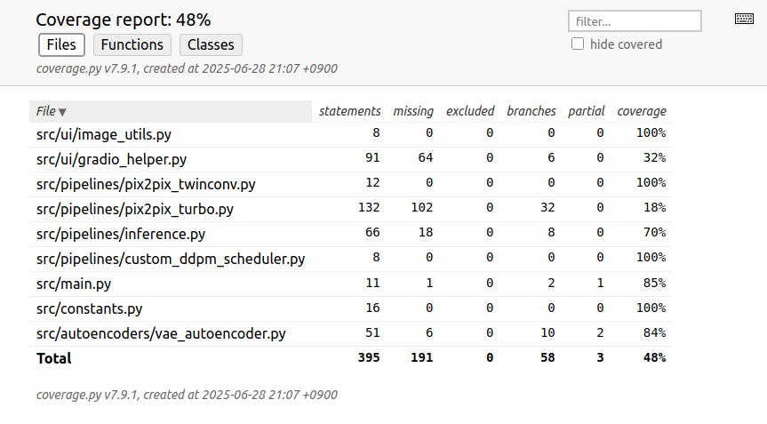

```
📁 project-root/
├── 📁 checkpoints/         # (자동다운로드) 학습/추론용 모델 체크포인트(pkl)
├── 📁 model/               # (자동다운로드) 모델
├── 📁 src/
│   ├── 📁 autoencoders/    #VAE 인코더/디코더
│   │   ├── __init__.py
│   │   └── vae_autoencoder.py
│   ├── 📁 pipelines/       # 추론에 사용되는 파일들
│   │   ├── custom_ddpm_scheduler.py    
│   │   ├── inference.py  
│   │   ├── __init__.py
│   │   ├── pix2pix_turbo.py
│   │   └── pix2pix_twinconv.py
│   ├── 📁 ui/              # 화면 UI
│   │   ├── gradio_helper.py
│   │   ├── image_utils.py
│   │   └── __init__.py
│   ├── constants.py
│   ├── __init__.py
│   └── main.py             # main
├── 📁 tests/  
│   ├── 📁 autoencoders/
│   │   └── test_vae_autoencoder.py
│   ├── 📁 pipelines/
│   │   ├── test_custom_ddpm_scheduler.py
│   │   ├── test_inference.py
│   │   ├── test_pix2pix_turbo.py
│   │   └── test_pix2pix_twinconv.py
│   ├── 📁 ui/
│   │   ├── test_gradio_helper.py
│   │   └── test_image_utils.py
│   └── test_main.py
├── conftest.py             # 테스트 경로 환경 설정
├── README.md
├── requirements.txt
```

- main.py는 OpenVINO-turtleNeck 폴더위치에서 실행하세요.

## 🧪 Pytest 사용법

- **전체 테스트 실행**
  ```bash
  cd model-test/ss
  pytest
  ```
- **특정 파일만 테스트**
  ```bash
  pytest ./tests/pipelines/test_pix2pix_twinconv.py
  ```

## 📊 커버리지 리포트 확인

- **터미널 출력 + HTML 리포트 생성**
  ```bash
  pytest --cov=src --cov-report=term-missing --cov-report=html --cov-branch --cov-config=.coveragerc
  ```
- **HTML 리포트 위치:**
  - `htmlcov/index.html` 파일을 브라우저로 열면 상세 커버리지 리포트 확인 가능

---



